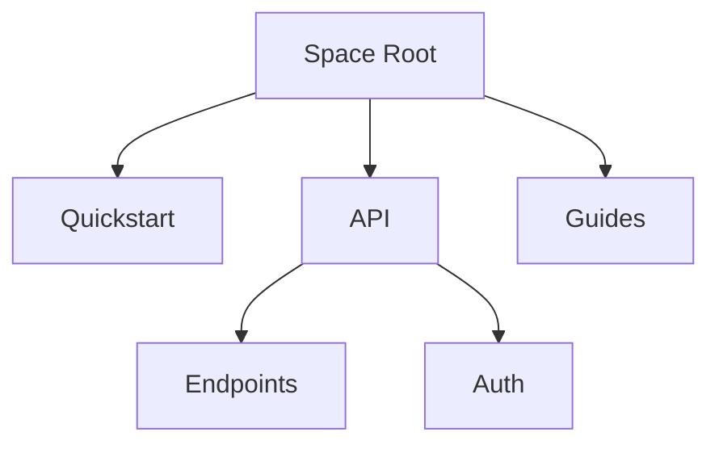

## Overview

Siva Documentation helps you organize project knowledge efficiently. You create documentation spaces to group related content, structure projects with folders and pages, manage content through edits and versioning, and collaborate with teams using real-time features. Master these core concepts to build scalable documentation.

<Columns cols={2}>
  <Card title="Documentation Spaces" icon="folder" href="#documentation-spaces">
    Isolate projects in dedicated spaces for better organization.
  </Card>
  <Card title="Project Organization" icon="layout" href="#project-organization">
    Use folders, tags, and hierarchies to navigate content easily.
  </Card>
  <Card title="Content Management" icon="edit-3" href="#content-management">
    Edit, version, and publish pages with intuitive tools.
  </Card>
  <Card title="Collaboration" icon="users" href="#collaboration">
    Work together with comments, approvals, and sharing.
  </Card>
</Columns>

## Documentation Spaces

Documentation spaces act as containers for your projects. You create a space for each major initiative, like `api-docs` or `user-guides`, to keep content separate and searchable.

<Steps>
  <Step title="Create a Space" icon="plus">
    Navigate to the dashboard and select **New Space**. Enter a name like `MyProjectDocs` and a description.
  </Step>
  <Step title="Configure Settings" icon="settings">
    Set permissions, brand color (e.g., `#3B82F6`), and default templates.
  </Step>
  <Step title="Add Content" icon="file-plus">
    Upload your first MDX file or create pages directly.
  </Step>
</Steps>

<Callout kind="tip">
  Use descriptive names for spaces, such as `v2-api-reference`, to improve discoverability.
</Callout>

## Project Organization

Organize your space using folders, tags, and navigation menus. Choose strategies based on your project's complexity.

<Tabs>
  <Tab title="Folder Structure" icon="folder">
    Create nested folders for hierarchy.

    ```
    docs/
    ├── quickstart.mdx
    ├── api/
    │   ├── endpoints.mdx
    │   └── auth.mdx
    └── guides/
        └── advanced.mdx
    ```
  </Tab>
  <Tab title="Tags and Search" icon="tag">
    Apply tags like `feature`, `bugfix` for filtering.

    <CodeGroup tabs="MDX Config">
      ```yaml
      ---
      tags: ["api", "auth"]
      ---
      ```
      ```json
      {
        "tags": ["feature", "v2.0"]
      }
      ```
    </CodeGroup>
  </Tab>
</Tabs>



## Content Management Basics

You edit pages in MDX format, preview changes live, and publish with versioning. Use components like `<Callout>` for emphasis and code blocks for examples. Track history to revert changes if needed.

## Collaboration Fundamentals

<Expandable title="Enable Team Collaboration" default-open="true">
  Invite users via email, assign roles (`editor`, `viewer`), and use inline comments. Real-time edits sync across browsers.

  <Image
    src="https://example.com/collaboration-screenshot.png"
    alt="Team editing a documentation page together"
    width="800"
    height="500"
  />

  Share public links for external reviews without accounts.
</Expandable>

<Callout kind="info">
  Always review changes before publishing to maintain quality.
</Callout>