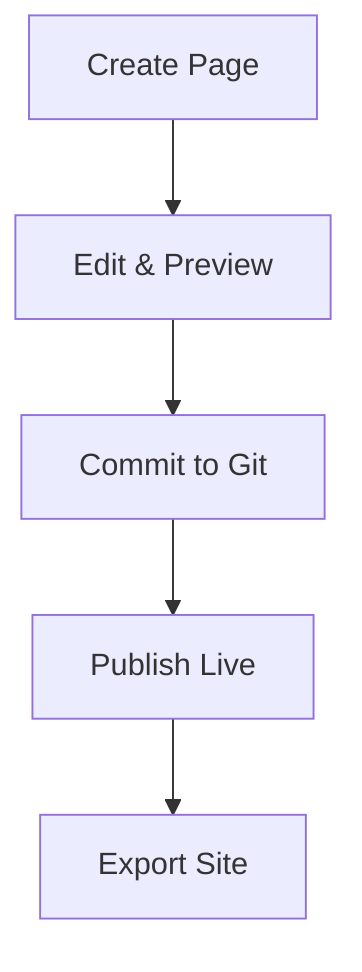

## Overview

Siva provides intuitive tools to create, organize, and maintain your project documentation. You organize content into pages and sections, link related topics, integrate version control, and export sites when ready. Follow these steps to build a professional documentation space.

<Columns cols={3}>
  <Card title="Create Pages" icon="file-plus" href="#creating-pages">
    Start new pages quickly.
  </Card>
  <Card title="Structure Content" icon="layout" href="#structuring-content">
    Link and organize topics.
  </Card>
  <Card title="Version Control" icon="git-branch" href="#version-control">
    Track changes with Git.
  </Card>
</Columns>

## Creating and Editing Pages

Build your documentation by creating MDX pages directly in Siva's editor.

<Steps>
  <Step title="Create a New Page" icon="plus">
    Navigate to your workspace. Click **New Page** in the sidebar. Enter a title like "API Reference" and select MDX format.
  </Step>
  <Step title="Edit Content" icon="edit-3">
    Use the visual editor for markdown or switch to source mode for components. Add headings, code blocks, and JSX elements like `<Callout>`.
  </Step>
  <Step title="Preview and Publish" icon="eye">
    Preview changes live. Click **Publish** to make the page live.
  </Step>
</Steps>

<Callout kind="tip">
  Save drafts automatically. Use `Ctrl+S` (`Cmd+S` on macOS) for manual saves.
</Callout>

## Structuring and Linking Content

Organize pages into a hierarchy and link them seamlessly.

<Tabs>
  <Tab title="Navigation Menu" icon="menu">
    Drag pages in the sidebar to create sections. Siva auto-generates a navigation menu from your structure.
  </Tab>
  <Tab title="Internal Links" icon="link">
    Link pages with markdown: `[Installation Guide](/docs/installation)`. Use anchors for sections: `[Overview](#overview)`.
  </Tab>
  <Tab title="Frontmatter" icon="tag">
    Add YAML frontmatter to pages for metadata:

    ```yaml
    ---
    title: My Page
    description: Page summary
    ---
    ```
  </Tab>
</Tabs>

## Version Control Integration

Connect your Siva workspace to Git for full version history.

<CodeGroup tabs="GitHub, GitLab">
  ```bash
  # Clone your Siva repo
  git clone https://github.com/your-org/siva-docs.git
  cd siva-docs

  # Make changes and commit
  git add .
  git commit -m "Add API endpoints docs"
  git push origin main
  ```
  ```bash
  # Connect to GitLab
  git clone https://gitlab.com/your-group/siva-docs.git
  cd siva-docs

  # Commit workflow
  git add pages/
  git commit -m "Update installation guide"
  git push origin main
  ```
</CodeGroup>

<Callout kind="alert">
  Enable Git sync in workspace settings to pull changes automatically.
</Callout>

## Exporting Documentation

Export your site for hosting or static deployment.

<Expandable title="Export Options" default-open="true">
  Choose from these formats:

  | Format     | Use Case                  | Command                  |
  |------------|---------------------------|--------------------------|
  | Static HTML | Custom hosting           | `siva export html`      |
  | PDF        | Printable guides         | `siva export pdf`       |
  | Markdown   | Migrate to other tools   | `siva export md`        |

  Run exports from the CLI after installing `@siva/cli`:

  ```bash
  npm install -g @siva/cli
  siva export --site my-docs --output ./dist
  ```
</Expandable>

## Advanced Workflow



Maintain consistency by reviewing changes in pull requests before merging. Use labels like `docs` and `enhancement` in your Git repo.